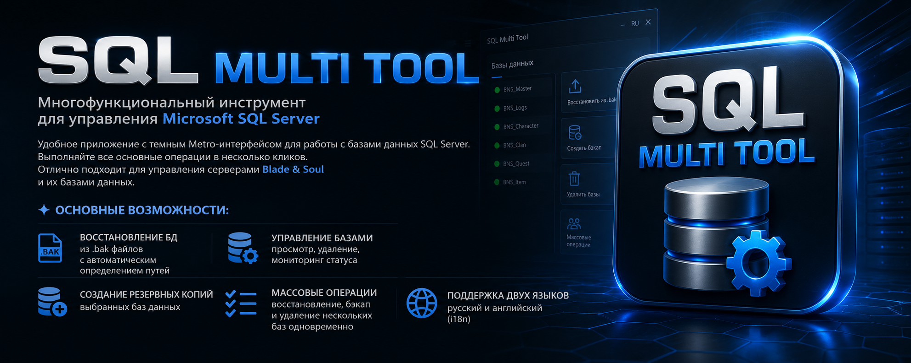
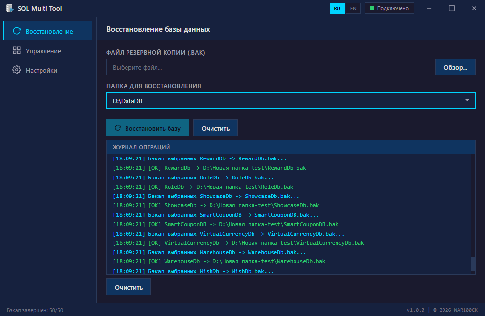

 

# SQL Multi Tool

<p align="center">
  
</p>

<p align="center">
  <b>A multifunctional tool for managing Microsoft SQL Server — database restore, backup, and deletion.</b><br>
  <a href="README.ru.md">Читать на Русском</a>
</p>

<p align="center">
  
  
  
  
</p>


## Technology Stack

| Component | Technology | Version |
|-----------|-----------|---------|
| Backend | Rust + Tokio + Tiberius | 1.70+ |
| Frontend | Tauri (WebView2), Vanilla JS, HTML5, CSS3 | — |
| UI Style | Custom Metro UI, dark theme | — |

---

## 📸 Screenshots

<p align="center">
  <i>Main interface</i><br>
  
</p>

---

## Requirements

- **Rust** 1.70+ (https://rustup.rs/)
- **Tauri CLI**: `cargo install tauri-cli`
- **WebView2 Runtime** (Windows 10/11 — installed automatically)
- **Microsoft SQL Server** with TCP/IP enabled (port 1433)

## Installation and Build

```bash
# 1. Unpack the project
cd sql_multi_tool

# 2. Install Tauri CLI (once)
cargo install tauri-cli

# 3. Build release (hidden console)
build.bat

# Or dev mode
dev.bat
```

## Project Structure

```
sql_multi_tool/
├── src/                          # Frontend
│   ├── index.html               # UI (Metro UI, i18n)
│   ├── style.css                # Dark theme, sharp corners
│   ├── app.js                   # Logic + i18n + bulk operations
│   └── icon.png                 # Application icon
├── src-tauri/                    # Backend (Rust)
│   ├── src/main.rs              # Commands: test, restore, backup, delete
│   ├── Cargo.toml               # Dependencies
│   ├── tauri.conf.json          # Window configuration (frameless)
│   └── icons/                   # Build icons
├── build.bat                     # Release build
├── dev.bat                       # Dev mode
└── README.md                     # This file
```

## Features

### "Restore" Tab
- **Bulk restore**: select multiple `.bak` files via dialog
- Automatic detection of restore folders from SQL Server
- `RESTORE DATABASE` with `MOVE` files (.mdf / .ldf)
- Progress bar and operation log with detailed output
- Support for replacing existing databases (`REPLACE`)

### "Manage" Tab
- List of user databases (excluding system ones)
- Display size and status (Online/Offline)
- **Bulk backup**: select multiple databases via checkboxes → create `.bak` for each
- **Bulk deletion**: select multiple databases → delete with confirmation
- Two backup naming formats:
  - `DBName_20260714_145541.bak` (with date and time)
  - `DBName.bak` (simple)

### "Settings" Tab
- Server, login, password for SQL Server
- Connection testing
- Auto-save to `localStorage`
- Default backup naming format selection

## Internationalization (i18n)

Language switch via **RU / EN** buttons in the title bar:
- **English** (default)
- **Russian**

Language is saved to `localStorage`.

## Notifications

- **In-app toast notifications only** (no Windows Notifications)
- Color indication: green (success), red (error), blue (info)
- Auto-hide after 4 seconds

## UI Styling

- **Metro UI**: sharp corners, flat design, no rounding
- **Dark theme**: deep blue and gray tones
- **Frameless window**: custom title bar with drag-region
- **SVG icons** on all buttons and navigation
- **Hidden console** in release (`#![windows_subsystem = "windows"]`)
- **Disabled context menu** (right-click)

## Security

- Password stored locally in `localStorage` (not sent anywhere)
- Connection via SQL Authentication (login/password)
- `trust_cert()` for simplicity (in production, configure certificates)

## 📜 License

This project is licensed under the **MIT License**.

See [LICENSE](LICENSE) for details.

